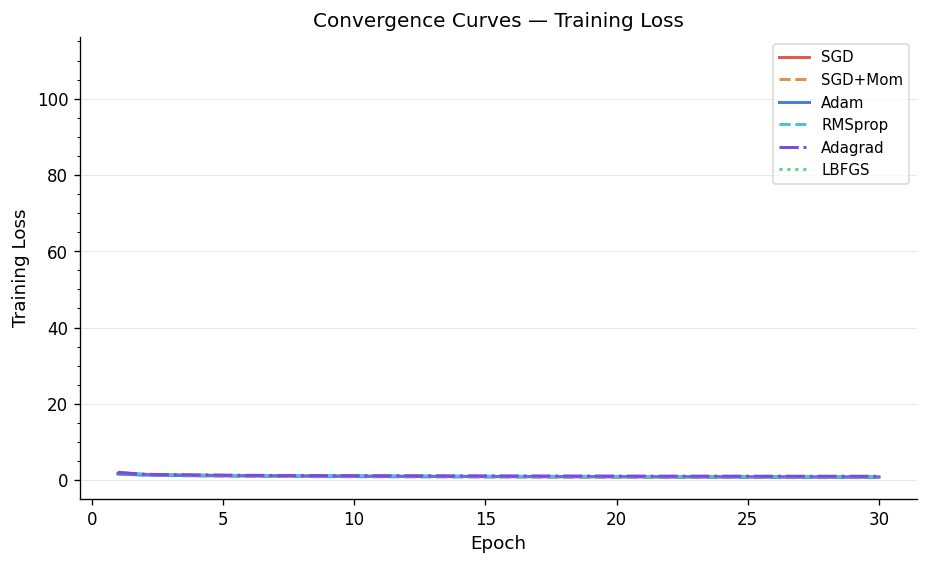
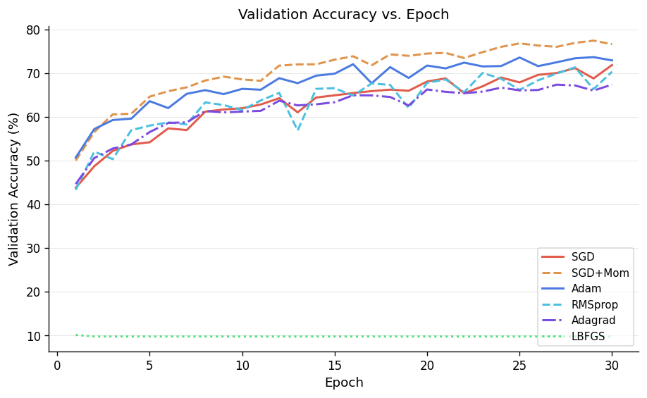
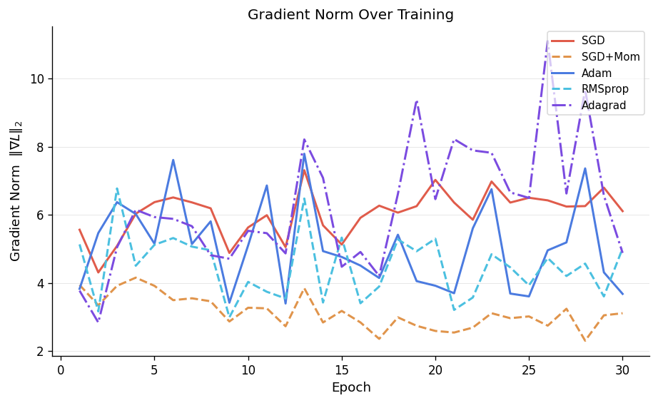
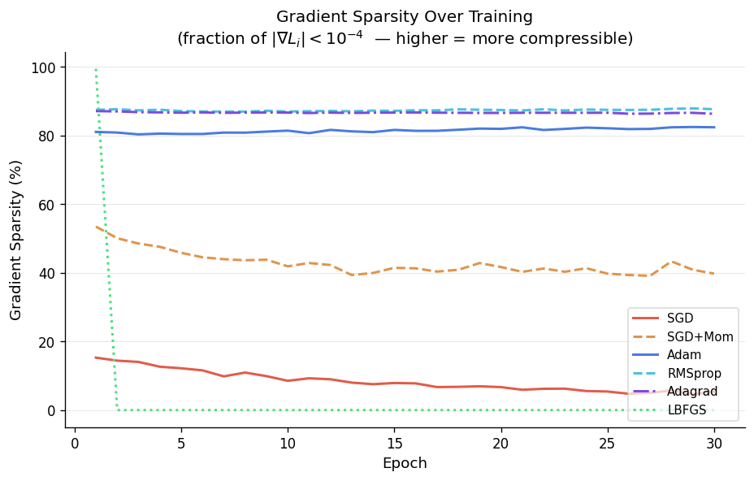
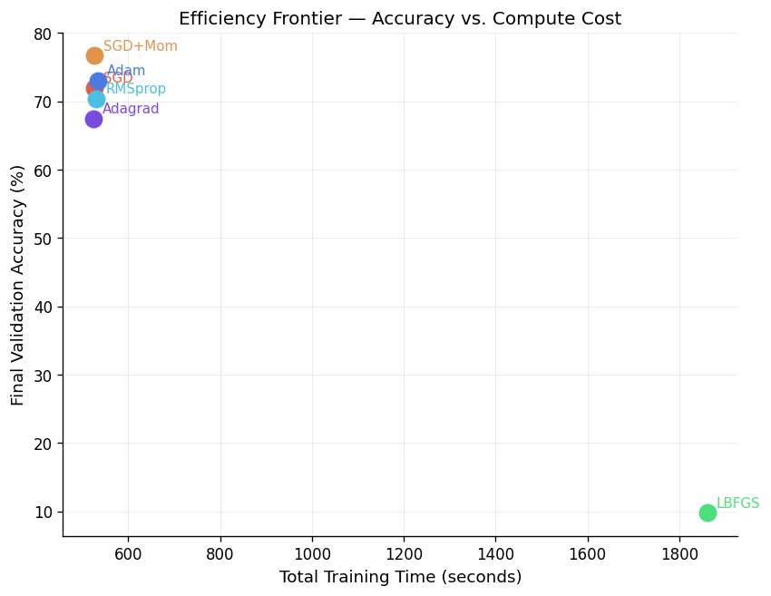
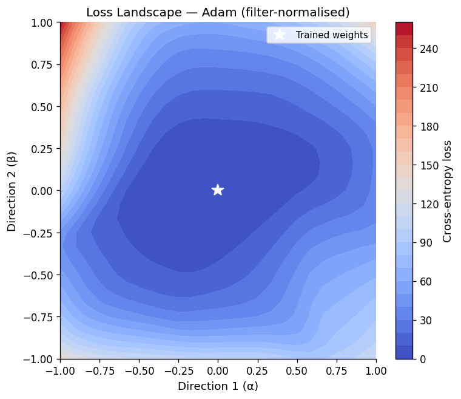
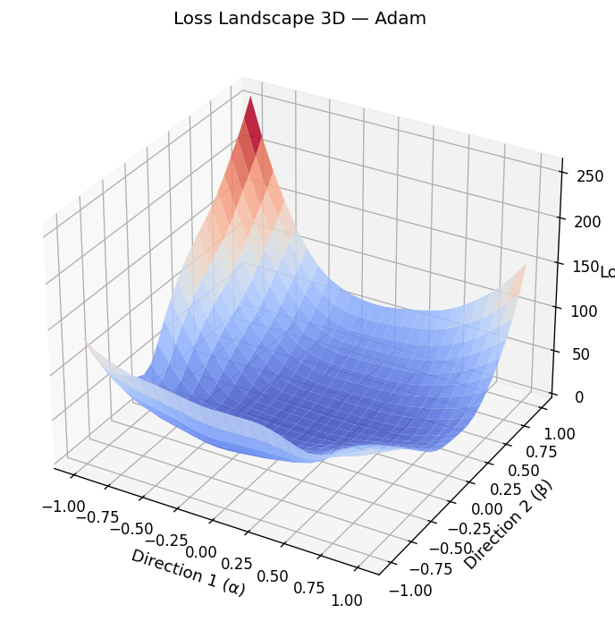

# Neural Network Optimization: Convergence, Generalization, and Gradient Compressibility

[](https://www.python.org/)
[](https://pytorch.org/)
[](LICENSE)
[](https://www.cs.toronto.edu/~kriz/cifar.html)
[](https://colab.research.google.com/drive/1cLkyrnN0JFUZZaJakg9TRbReMi40RsW9?usp=sharing)

---

## Motivation

The standard narrative in optimization for deep learning treats faster convergence as an unambiguous improvement. Adaptive methods Adam, RMSprop reduce training loss faster than SGD in virtually every benchmark. Yet practitioners have consistently observed that SGD with momentum often generalizes better than Adam on image classification, despite converging more slowly.

This tension between convergence speed and generalization quality is not well explained by classical optimization theory, which analyzes convergence to a minimum without accounting for *which* minimum is found. Loss landscape geometry offers a partial explanation: SGD tends to converge to flatter minima, while adaptive methods converge to sharper basins and flatter minima are empirically associated with better generalization under distribution shift.

A second motivation comes from distributed training. As models scale, gradient communication between workers becomes a critical bottleneck. Compression methods such as PowerSGD (Vogels et al., 2019) exploit low-rank structure in gradient matrices to reduce communication cost. But the compressibility of gradients is not optimizer-independent  it depends on how the optimizer shapes gradient magnitudes and sparsity patterns throughout training. Understanding optimizer behavior at the single-machine level is therefore a prerequisite for designing communication-efficient distributed algorithms.

This project investigates both dimensions: the generalization-speed tradeoff across first- and second-order methods, and the implications for gradient compressibility in distributed training settings.

---

## Research Questions

1. **Convergence vs. generalization tradeoff** - Do adaptive methods that converge faster systematically converge to sharper loss minima, and does this explain observed generalization gaps?

2. **Loss landscape geometry** - Can filter-normalized loss surface visualizations characterize the qualitative differences in minima found by SGD, momentum, and adaptive optimizers?

3. **Gradient compressibility** - Do different optimizers produce gradients with different sparsity and low-rank structure over the course of training, and which optimizer produces the most compressible gradient signal?

4. **Second-order methods in the stochastic setting** - Under what conditions does the curvature information in L-BFGS become unreliable, and how does gradient noise interact with the Hessian approximation?

---

## Methodology

### Problem Formulation

Given a parameterized model $f_\theta$ and dataset $\mathcal{D} = \{(x_i, y_i)\}_{i=1}^N$, we minimize empirical risk:

$$\min_{\theta} \; \mathcal{L}(\theta) = \frac{1}{N} \sum_{i=1}^N \ell(f_\theta(x_i), y_i)$$

where $\ell$ is cross-entropy loss. In the stochastic setting, gradient estimates use mini-batches $\mathcal{B} \subset \mathcal{D}$.

### Optimizers

Six update rules are compared:

| Optimizer | Type | Key property |
|---|---|---|
| SGD | First-order | Baseline; $O(1/\sqrt{T})$ convergence |
| SGD + Momentum | First-order | Polyak heavy-ball; dampens oscillations |
| Adam | Adaptive | Per-parameter moment estimates; $O(1/T)$ convex |
| RMSprop | Adaptive | Running squared-gradient normalization |
| Adagrad | Adaptive | Monotonically accumulating denominator |
| L-BFGS | Second-order | Quasi-Newton; approximates inverse Hessian |

SGD and SGD+Momentum are implemented from scratch in `optimizers.py` without PyTorch optimizer primitives, to allow direct inspection of update mechanics.

### Architecture and Dataset

A shallow CNN trained on CIFAR-10 (50K train / 10K test). The architecture is intentionally kept simple optimizer differences are most legible at this scale before depth effects dominate.

```
Input (3 × 32 × 32)
  → Conv2d(3, 32, 3×3) + BN + ReLU + MaxPool(2×2)
  → Conv2d(32, 64, 3×3) + BN + ReLU + MaxPool(2×2)
  → Flatten → Linear(4096, 256) + Dropout(0.3) + ReLU
  → Linear(256, 10)
```

~186K parameters. All optimizers trained from the same random seed for 30 epochs, batch size 128, on an NVIDIA Tesla T4 GPU.

### Evaluation

Beyond final accuracy, we track:
- Per-epoch training loss and validation accuracy (convergence trajectory)
- Gradient $\ell_2$ norm over training (gradient norm dynamics)
- Gradient sparsity: fraction of elements with $|\nabla \mathcal{L}_i| < 10^{-4}$ (proxy for compressibility)
- Wall-clock time and total gradient evaluations (computational cost)
- Loss landscape geometry via filter-normalized 2D/3D surface visualization (Li et al., 2018)

---

## Key Findings

### 1. Convergence speed and generalization trade off systematically

SGD+Momentum achieved the best final validation accuracy (76.7%) despite not being the fastest to converge early. Adam converged faster in the first 10 epochs but plateaued 3.7 percentage points below SGD+Momentum consistent with the generalization gap reported in Wilson et al. (2017) and Keskar & Socher (2017).

| Optimizer | Final Val Acc | Epochs to 90% | Total Time (s) |
|---|---|---|---|
| SGD | 71.9% | 24 | 527 |
| **SGD+Momentum** | **76.7%** | **9** | 527 |
| Adam | 73.0% | 14 | 533 |
| RMSprop | 70.4% | 23 | 530 |
| Adagrad | 67.4% | 30 | 525 |
| L-BFGS | diverged | - | 1861 |

### 2. Loss landscape geometry explains the generalization gap

Filter-normalized loss surface visualizations show that SGD+Momentum converges to a qualitatively flatter basin than Adam. Wider contours correspond to solutions more robust to weight perturbation directly relevant to the stability of compressed gradient updates in distributed training, where each worker's gradient is an imperfect approximation of the true gradient.

### 3. Gradient sparsity patterns differ across optimizers

Per-parameter normalization in adaptive methods (Adam, RMSprop) produces higher gradient sparsity mid-training compared to SGD. Sparser gradients are more amenable to top-k sparsification, while the denser but lower-rank structure of SGD gradients is better targeted by PowerSGD-style compression. This creates a compression strategy tradeoff that depends on optimizer choice.

### 4. L-BFGS is incompatible with the mini-batch setting

L-BFGS diverged immediately (loss → NaN at epoch 1) with batch size 128. The Hessian approximation requires consistent gradient estimates across steps which mini-batch noise destroys. Despite 211K gradient evaluations (20× first-order methods), it failed to learn, confirming that second-order structure requires either full-batch gradients or noise-robust curvature approximations.

---

## Visual Results

| Figure | Description |
|---|---|
| `results/convergence_loss.png` | Training loss vs epoch for all six optimizers |
| `results/convergence_acc.png` | Validation accuracy vs epoch |
| `results/gradient_norm.png` | $\|\nabla \mathcal{L}\|_2$ over training |
| `results/gradient_sparsity.png` | Fraction of near-zero gradient elements per optimizer |
| `results/efficiency_frontier.png` | Final accuracy vs total compute time |
| `results/convergence_speed.png` | Epochs to reach 90% of best accuracy |
| `results/loss_landscape.png` | 2D filter-normalized loss landscape (Adam) |
| `results/loss_landscape_3d.png` | 3D loss surface (Adam) |









---

## Connection to Distributed Optimization and Gradient Compression

In data-parallel distributed training, gradients must be aggregated across workers before each parameter update. Communication cost grows linearly with the number of parameters, making gradient compression a prerequisite for large-scale training.

Two properties of the gradient govern compressibility:

- **Sparsity**: near-zero elements can be dropped with no information loss (top-k sparsification)
- **Low effective rank**: approximately low-rank gradient matrices can be communicated as factor pairs the key insight behind PowerSGD (Vogels, Karimireddy, & Jaggi, 2019)

The gradient sparsity trajectories in this study suggest that adaptive optimizers produce more compressible gradient signals mid-training, but converge to sharper minima that may be less robust to the approximation error introduced by compression. This creates a tension: the optimizer most amenable to gradient compression may not be the optimizer best suited for generalization  a tradeoff that becomes especially relevant in non-IID federated settings where both gradient variance and communication constraints are simultaneously active.

---

## Future Work

This study examines optimizer behavior in an idealized single-machine, IID setting. Several extensions follow directly from the findings:

**Gradient compression in distributed training**  
Test whether the sparsity advantage of adaptive methods translates to measurable communication savings when combined with top-k sparsification or low-rank compression (PowerSGD). Measure the accuracy-compression tradeoff for each optimizer separately.

**Non-IID data distributions**  
Real federated learning settings involve heterogeneous data across workers. Examine how optimizer convergence properties change when local data distributions diverge increasing both gradient noise and cross-worker gradient variance simultaneously.

**Noise-robust curvature approximation**  
L-BFGS fails in the mini-batch setting due to gradient noise. Investigate whether variance reduction (SVRG, SARAH) can stabilize second-order methods at practical batch sizes, and at what gradient evaluation budget this becomes worthwhile.

**Loss landscape geometry and compression robustness**  
The flatness of SGD minima suggests robustness to weight perturbation. Test whether solutions found by SGD+Momentum tolerate gradient compression error better than Adam solutions, and whether this tolerance scales with basin width.

---

## Repository Structure

```
nn-optimizer-study/
├── model.py            # CNN architecture (CIFAR-10 and MNIST variants)
├── optimizers.py       # Hand-implemented SGD and SGD+Momentum
├── train.py            # Training loop, data loading, checkpointing
├── analysis.py         # Convergence plots and summary CSV
├── loss_landscape.py   # Filter-normalized loss surface visualization
├── main.py             # Full experiment pipeline
├── quick_test.py       # 5-minute MNIST smoke test
├── run_all.py          # Convenience entry point
├── requirements.txt
└── README.md
```

---

## Setup and Usage

```bash
# Install dependencies
pip install torch torchvision --index-url https://download.pytorch.org/whl/cpu
pip install -r requirements.txt

# Quick test (5 minutes, MNIST)
python quick_test.py

# Full experiment (CIFAR-10, ~1-3 hours on CPU)
python main.py

# Individual stages
python train.py                              # train all optimizers
python analysis.py                           # generate all plots
python loss_landscape.py --optimizer Adam    # visualize loss landscape
```

---

## References

1. Kingma, D. P., & Ba, J. (2015). Adam: A Method for Stochastic Optimization. *ICLR 2015*.
2. Vogels, T., Karimireddy, S. P., & Jaggi, M. (2019). PowerSGD: Practical Low-Rank Gradient Compression for Distributed Optimization. *NeurIPS 2019*.
3. Li, H., Xu, Z., Taylor, G., Studer, C., & Goldstein, T. (2018). Visualizing the Loss Landscape of Neural Nets. *NeurIPS 2018*.
4. Wilson, A. C., Roelofs, R., Stern, M., Srebro, N., & Recht, B. (2017). The Marginal Value of Momentum for Small Learning Rate SGD. *ICLR 2018*.
5. Keskar, N. S., & Socher, R. (2017). Improving Generalization Performance by Switching from Adam to SGD. *arXiv:1712.07628*.
6. Reddi, S. J., Kale, S., & Kumar, S. (2018). On the convergence of Adam and beyond. *ICLR 2018*.
7. Nocedal, J. (1980). Updating quasi-Newton matrices with limited storage. *Mathematics of Computation*.

---

## Citation

```bibtex
@misc{awari2025optimizers,
  author = {Awari, Ajinkya},
  title  = {Neural Network Optimization: Convergence, Generalization, and Gradient Compressibility},
  year   = {2025},
  url    = {https://github.com/ajinkya-awari/nn-optimizer-study}
}
```

---

*Author: Ajinkya Avinash Awari Savitribai Phule Pune University*
