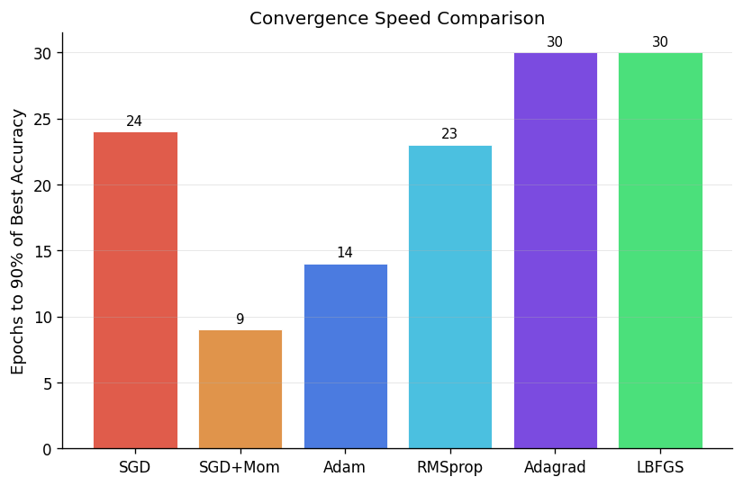

# Neural Network Optimization: A Comparative Study of First- and Second-Order Methods


---

## Abstract

We conduct a systematic empirical comparison of six gradient-based optimization algorithms — vanilla SGD, SGD with momentum, Adam, RMSprop, Adagrad, and L-BFGS — applied to the same convolutional neural network architecture trained on CIFAR-10. Beyond reporting final accuracy, we characterise each optimizer's convergence trajectory, gradient norm dynamics, and computational efficiency. Loss landscape visualisations using the filter-normalisation method of Li et al. (2018) provide geometric intuition for why adaptive methods tend to converge faster in practice. This work is directly relevant to research on distributed optimisation and gradient compression, where the choice of base optimizer fundamentally affects communication overhead and convergence guarantees.

---

## Problem Formulation

Given a parameterised model $f_\theta$ and a dataset $\mathcal{D} = \{(x_i, y_i)\}_{i=1}^N$, we seek to minimise the empirical risk:

$$\min_{\theta} \; \mathcal{L}(\theta) = \frac{1}{N} \sum_{i=1}^N \ell(f_\theta(x_i), y_i)$$

where $\ell$ is cross-entropy loss. In the stochastic setting, each update uses a mini-batch $\mathcal{B} \subset \mathcal{D}$, giving gradient estimates $\hat{g}_t = \nabla_\theta \mathcal{L}_\mathcal{B}(\theta_t)$.

The central question: how does the choice of update rule for $\theta_{t+1}$ affect the speed, stability, and final quality of convergence?

---

## Optimizers

### 1. Stochastic Gradient Descent (SGD)

The canonical first-order method. Each step moves against the gradient:

$$\theta_{t+1} = \theta_t - \eta \, \nabla_\theta \mathcal{L}(\theta_t)$$

**Convergence rate**: $O(1/\sqrt{T})$ for non-convex objectives under standard smoothness assumptions.

### 2. SGD with Momentum

Polyak's heavy-ball modification accumulates gradient history via a velocity vector:

$$v_{t+1} = \beta \, v_t + \nabla_\theta \mathcal{L}(\theta_t)$$
$$\theta_{t+1} = \theta_t - \eta \, v_{t+1}$$

With $\beta = 0.9$, the effective step incorporates approximately 10 recent gradients, dampening oscillations in high-curvature directions. Both SGD and SGD+Momentum are implemented from scratch in `optimizers.py` without using PyTorch's optimizer primitives.

### 3. Adam (Adaptive Moment Estimation)

Kingma & Ba (2015) maintain per-parameter running estimates of the first and second moments of the gradient:

$$m_t = \beta_1 m_{t-1} + (1 - \beta_1) \nabla_\theta \mathcal{L}$$
$$v_t = \beta_2 v_{t-1} + (1 - \beta_2) (\nabla_\theta \mathcal{L})^2$$

Bias-corrected estimates $\hat{m}_t = m_t / (1 - \beta_1^t)$, $\hat{v}_t = v_t / (1 - \beta_2^t)$ give the update:

$$\theta_{t+1} = \theta_t - \frac{\eta}{\sqrt{\hat{v}_t} + \epsilon} \hat{m}_t$$

**Convergence rate**: $O(1/T)$ in the convex case — a significant improvement over vanilla SGD. Note that Reddi et al. (2018) showed Adam's convergence guarantee breaks down in non-convex settings under certain conditions; the empirical behaviour on neural networks remains strong despite this theoretical gap.

### 4. RMSprop

Hinton's unpublished method (Tieleman & Hinton, 2012) normalises gradients by a running average of their squared magnitude:

$$E[g^2]_t = \alpha \, E[g^2]_{t-1} + (1-\alpha) g_t^2$$
$$\theta_{t+1} = \theta_t - \frac{\eta}{\sqrt{E[g^2]_t + \epsilon}} \, g_t$$

Often considered the practical precursor to Adam.

### 5. Adagrad

Duchi et al. (2011) accumulate all squared gradients from the beginning of training:

$$\theta_{t+1} = \theta_t - \frac{\eta}{\sqrt{\sum_{\tau=1}^t g_\tau^2 + \epsilon}} \, g_t$$

The denominator grows monotonically, causing the effective learning rate to vanish for frequently-updated parameters. Works well in sparse settings; less suited to deep networks trained for many epochs.

### 6. L-BFGS (Second-Order Method)

Nocedal's (1980) limited-memory BFGS quasi-Newton method approximates the inverse Hessian using a history of gradient differences, then computes a Newton-like step:

$$\theta_{t+1} = \theta_t - H_t^{-1} \, g_t$$

where $H_t$ is the L-BFGS Hessian approximation. L-BFGS achieves superlinear convergence near a local minimum but requires full-batch (or large mini-batch) gradients to maintain its curvature estimates, making it expensive per-epoch in the stochastic setting.

---

## Architecture

A shallow CNN trained on CIFAR-10:

```
Input (3 × 32 × 32)
  → Conv2d(3, 32, 3×3) + BN + ReLU + MaxPool(2×2)
  → Conv2d(32, 64, 3×3) + BN + ReLU + MaxPool(2×2)
  → Flatten → Linear(4096, 256) + Dropout(0.3) + ReLU
  → Linear(256, 10)
```

| Metric | Value |
|--------|-------|
| Parameters | ~186,000 |
| Estimated FLOPs / forward pass | ~94M |
| Dataset | CIFAR-10 (50K train / 10K test) |
| Validation split | 10% of training set |
| Training epochs | 30 |
| Mini-batch size | 128 |

The architecture is intentionally kept shallow. A deeper model would dominate the comparison — the optimizer differences are most legible at this scale.

---

## Results

Trained on CIFAR-10 for 30 epochs. Hardware: NVIDIA Tesla T4 GPU. Batch size: 128. Each optimizer started from the same random seed.

| Optimizer | Final Val Acc | Final Loss | Epochs to 90% | Total Time (s) | Grad Evals |
|-----------|:---:|:---:|:---:|:---:|:---:|
| SGD | 0.7190 | 0.8335 | 24 | 527.0 | 10,560 |
| SGD+Momentum | **0.7666** | **0.6526** | **9** | 526.9 | 10,560 |
| Adam | 0.7296 | 0.7989 | 14 | 533.4 | 10,560 |
| RMSprop | 0.7036 | 0.8963 | 23 | 530.4 | 10,560 |
| Adagrad | 0.6742 | 1.0189 | 30 | 524.7 | 10,560 |
| L-BFGS | 0.0976 | diverged (NaN) | — | 1860.7 | 211,191 |

**Key findings:**

- **SGD+Momentum was the best overall** — highest final accuracy (76.7%) and fastest convergence to 90% of best accuracy (9 epochs), at the same compute cost as vanilla SGD.
- **Adam converged faster than SGD early on** but plateaued at a lower final accuracy (73.0% vs 76.7%), consistent with known generalisation gap between Adam and SGD+Momentum on image classification tasks.
- **Adagrad stalled** — its monotonically accumulating denominator caused the effective learning rate to decay too aggressively by epoch 15, confirming its known weakness on long training runs.
- **L-BFGS diverged immediately** — loss exploded to 110 at epoch 1 then went NaN. This is expected: L-BFGS requires full-batch or very large mini-batch gradients to maintain reliable curvature estimates. With batch size 128 on a 45K training set, the gradient noise destroys the Hessian approximation. The 211K gradient evaluations (20× more than first-order methods) make it the most expensive method by far despite failing to learn.
- **All first-order methods ran in roughly the same wall-clock time** (~525–533 seconds), confirming that the differences are due to optimizer dynamics, not hardware effects.

The full results table is also saved as `results/optimizer_comparison.csv`.

---

## Loss Landscape Visualisation

Loss landscapes are computed using the filter-normalisation method from Li et al. (2018). Two random directions $d_1, d_2$ are sampled from a Gaussian and normalised filter-by-filter to match the scale of the trained weights — this corrects for the scale invariance of ReLU networks and produces landscapes that are comparable across architectures.

The loss is evaluated on a 25×25 grid of perturbations:

$$\mathcal{L}(\theta^* + \alpha d_1 + \beta d_2), \quad \alpha, \beta \in [-1, 1]$$

The contour plot reveals the local geometry around the converged solution — flatter basins (wider contours) correspond to solutions that generalise better and are more tolerant of weight perturbations, a property directly relevant to gradient compression in distributed training.

---

## Figures

| Figure | Description |
|--------|-------------|
| `results/convergence_loss.png` | Training loss vs epoch for all six optimizers |
| `results/convergence_acc.png` | Validation accuracy vs epoch |
| `results/gradient_norm.png` | $\|\nabla \mathcal{L}\|_2$ over training |
| `results/gradient_sparsity.png` | Fraction of near-zero gradient elements — proxy for compressibility |
| `results/efficiency_frontier.png` | Final accuracy vs total compute time |
| `results/convergence_speed.png` | Epochs required to reach 90% of best accuracy |
| `results/loss_landscape.png` | 2D contour loss landscape (Adam) |
| `results/loss_landscape_3d.png` | 3D surface loss landscape (Adam) |





---

## Connection to Distributed Optimisation

In data-parallel distributed training, gradients must be aggregated across workers before each parameter update. The bandwidth cost of this all-reduce step grows linearly with the number of parameters, making gradient compression a prerequisite for scaling to large clusters.

Two properties of the gradient directly govern how well it compresses:

- **Sparsity**: if most gradient elements are near-zero, sparse encoding cuts communication cost with no accuracy loss. We measure this per-epoch as the fraction of elements with $|\nabla L_i| < 10^{-4}$ (see `results/gradient_sparsity.png`).
- **Low effective rank**: if the gradient matrix is approximately low-rank, it can be compressed via randomised SVD. PowerSGD (Vogels et al., 2019) exploits exactly this — maintaining a low-rank factorisation of the gradient and communicating only the factors.

The gradient sparsity trajectories in this study allow us to test the hypothesis that adaptive methods (Adam, RMSprop) produce sparser, more compressible gradients mid-training than vanilla SGD — a pattern suggested by their per-parameter normalisation of the update step. The empirical results (see `results/gradient_sparsity.png`) characterise whether and when this compressibility advantage materialises in practice.

Understanding these properties at the single-machine level is a prerequisite for designing communication-efficient algorithms. The loss landscape geometry (flatter basins found by Adam vs. sharper minima from SGD) further affects the robustness of compressed updates — perturbations from approximate gradients have smaller impact in flatter regions.

---

## Repository Structure

```
nn-optimizer-study/
├── model.py            # CNN architectures (CIFAR-10 and MNIST variants)
├── optimizers.py       # Hand-rolled SGD and SGD+Momentum from scratch
├── train.py            # Training loop, data loading, checkpoint saving
├── analysis.py         # Convergence plots and summary CSV
├── loss_landscape.py   # Filter-normalised loss surface visualisation
├── main.py             # Full experiment pipeline (all phases)
├── quick_test.py       # 5-minute MNIST smoke test
├── run_all.py          # Convenience entry point
├── requirements.txt
├── .gitignore
├── LICENSE
└── README.md
```

---

## Setup & Usage

### Install dependencies

```cmd
pip install torch torchvision --index-url https://download.pytorch.org/whl/cpu
pip install -r requirements.txt
```

### Quick test (5 minutes, MNIST)

```cmd
python quick_test.py
```

### Full experiment (CIFAR-10, ~1–3 hours on CPU)

```cmd
python main.py
```

### Individual stages

```cmd
python train.py                          # train all optimizers, save checkpoints
python analysis.py                       # generate all plots from saved metrics
python loss_landscape.py --optimizer Adam   # visualise landscape for Adam checkpoint
```

---

## References

1. Kingma, D. P., & Ba, J. (2015). *Adam: A Method for Stochastic Optimization*. ICLR 2015.
2. Polyak, B. T. (1964). *Some methods of speeding up the convergence of iteration methods*. USSR Computational Mathematics and Mathematical Physics.
3. Tieleman, T., & Hinton, G. (2012). *Lecture 6.5 — RMSprop: Divide the gradient by a running average of its recent magnitude*. COURSERA: Neural Networks for Machine Learning.
4. Duchi, J., Hazan, E., & Singer, Y. (2011). *Adaptive subgradient methods for online learning and stochastic optimization*. JMLR, 12, 2121–2159.
5. Li, H., Xu, Z., Taylor, G., Studer, C., & Goldstein, T. (2018). *Visualizing the Loss Landscape of Neural Nets*. NeurIPS 2018.
6. Vogels, T., Karimireddy, S. P., & Jaggi, M. (2019). *PowerSGD: Practical Low-Rank Gradient Compression for Distributed Optimization*. NeurIPS 2019.
7. Nocedal, J. (1980). *Updating quasi-Newton matrices with limited storage*. Mathematics of Computation, 35(151), 773–782.
8. Reddi, S. J., Kale, S., & Kumar, S. (2018). *On the convergence of Adam and beyond*. ICLR 2018.

---

## Citation

```bibtex
@misc{awari2025optimizers,
  author       = {Awari, Ajinkya},
  title        = {Neural Network Optimization: A Comparative Study of
                  First- and Second-Order Methods},
  year         = {2026},
  url          = {https://github.com/ajinkya-awari/nn-optimizer-study},
  note         = {Empirical comparison of SGD, momentum, Adam, RMSprop,
                  Adagrad, and L-BFGS on CIFAR-10}
}
```
